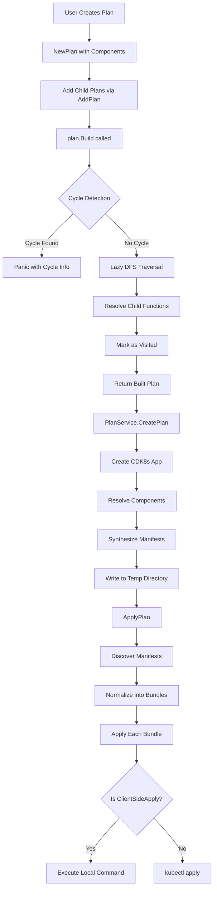

# CRIB SDK (Chainlink Running-in-a-Box SDK)

The CRIB SDK is an Infrastructure-as-Code (IaC) SDK for applications, designed to simplify the deployment and management of Chainlink nodes and other Kubernetes resources. It provides a component-based architecture that allows developers to define reusable components and deployment plans.

## Overview

The crib-sdk provides a structured way to define and deploy Kubernetes applications using a component-based approach. It uses CDK8s (Cloud Development Kit for Kubernetes) under the hood to synthesize Kubernetes manifests from high-level constructs.

## Table of Contents

- [Getting Started](#getting-started)
- [Architecture](#architecture)
  - [Components: Scalar vs Composite](#components-scalar-vs-composite)
  - [Plans](#plans)
  - [Plan Runtime Flow](#plan-runtime-flow)
- [Common Code Paths](#common-code-paths)
- [Development](#development)
  - [Prerequisites](#prerequisites)
  - [Building](#building)
  - [Testing and Linting](#testing-and-linting)
  - [Documentation](#documentation)
- [Contributing](#contributing)

## Getting Started

### Installation

```bash
# Clone the repository
git clone https://github.com/smartcontractkit/crib-sdk.git
cd crib-sdk

# Install dependencies
go mod download

# Install supporting tools
task install:tools

# Build cribctl
task build:cribctl

# You can now use cribctl to apply plans
.build/cribctl plan apply example
```

## Architecture

### Components: Scalar vs Composite

The SDK organizes components into two main categories:

#### Scalar Components

Located in [crib/scalar/](tree/main/crib/scalar), these are the basic building blocks of the SDK. Each scalar component:

- Lives in its own versioned package (e.g., `configmap/v1`, `namespace/v1`)
- Represents a single Kubernetes resource or simple operation
- Should be simple, composable, and reusable
- Does not include other components

Examples:

- **ConfigMap**: Creates Kubernetes ConfigMap resources
- **Namespace**: Creates Kubernetes Namespace resources
- **HelmChart**: Deploys Helm charts
- **ClientSideApply**: Executes client-side operations
- **RemoteApply**: Fetches and applies remote manifests

#### Composite Components

Located in [crib/composite/](tree/main/crib/composite), these are higher-level components that:

- Combine multiple scalar components or other resources
- Provide more complex functionality
- Can include dependencies and ordering logic

Example:

- **NginxController**: Fetches NGINX Ingress Controller manifests, creates namespace, applies manifests, and waits for pods to be ready

### Plans

Plans are the core abstraction for defining deployment strategies:

- Represent a Directed Acyclic Graph (DAG) of components and child plans
- Support hierarchical composition through child plans
- Include cycle detection to prevent circular dependencies
- Are built lazily during execution

Key concepts:

- **Components**: List of component functions to execute
- **ChildPlans**: Dependent plans that must be resolved
- **Namespace**: Primary target namespace for the plan
- **Build()**: Resolves the DAG and returns a plan with resolved dependencies

### Plan Runtime Flow



## Component-Specific Behaviors

### Chainlink Node Configuration Merging

The Chainlink Node composite component (`crib/composite/chainlink/node/v1`) implements deterministic configuration merging to ensure consistent behavior across deployments:

- **ConfigOverrides**: Additional configuration files are processed in lexicographic order by filename
- **SecretsOverrides**: Additional secrets files are processed in lexicographic order by filename

This sorting ensures that when Chainlink performs configuration merging, the same configuration files are applied in the same order regardless of map iteration order, providing predictable and reproducible deployments.

## Common Code Paths

### 1. Creating a Simple Plan

```go
// Create a plan with namespace component
plan := crib.NewPlan("my-app",
    crib.Namespace("my-namespace"),
    crib.ComponentSet(
        namespace.Component(&namespace.Props{
            Namespace: "my-namespace",
        }),
    ),
)
```

### 2. Component Creation Pattern

All components follow a similar pattern:

```go
// In scalar/[component]/v1/[component].go
func Component(props *Props) crib.ComponentFunc {
    return func(ctx context.Context) (crib.Component, error) {
        // Validate props
        if err := props.Validate(ctx); err != nil {
            return nil, err
        }
        // Create the component
        return New(ctx, props)
    }
}
```

### 3. Plan Service Usage

```go
// Create plan service
svc, err := service.NewPlanService(ctx)

// Create app plan
appPlan, err := svc.CreatePlan(ctx, plan)

// Apply the plan
err = appPlan.Apply(ctx)
```

### 4. Manifest Discovery and Application

The runtime discovers manifests in a specific order:

1. Scans synthesized manifests in temp directory
2. Groups manifests by directory
3. Separates ClientSideApply manifests from regular manifests
4. Applies bundles in order

## Development

### Prerequisites

- Go 1.24.0 or later
- Task ([https://taskfile.dev](taskfile.dev))
- [asdf](https://asdf-vm.com/)
- Pre-commit (*optional but recommended for code quality*) - `task install:pre-commit`
- Docker (for some operations)

### Building

```bash
# Build cribctl specifically
task build:cribctl
```

### Testing and Linting

```bash
# Run all tests
task go:test

# Run lint rules
task go:lint

# Format code
task go:fmt
```

### Documentation

The project includes a documentation site:

```bash
# Start the documentation server.
$ task docker:compose:up

🚀  Service godoc is available at http://localhost:2152.

# Stop the documentation server.
$ task docker:compose:down
```

## Contributing

### Pre-commit Hooks

This project uses pre-commit hooks to ensure code quality. Install them before making changes:

```bash
# Install pre-commit
task install:tools # recommended
# or
pip install pre-commit
# or
brew install pre-commit

# Install the git hooks
task install:pre-commit # recommended
# or
pre-commit install

# Run pre-commit on all files
task pre-commit # recommended
# or
pre-commit run --all-files
```

The pre-commit configuration includes:

- YAML formatting and linting
- Go linting (golangci-lint)
- JSON formatting
- Spell checking (codespell)
- GitHub Actions linting
- File formatting (end of file, trailing whitespace)

### Code Structure Guidelines

1. **Scalar Components**: Place new scalar components in `crib/scalar/[component]/v1/`
2. **Composite Components**: Place new composite components in `crib/composite/[component]/v1/`
3. **Tests**: Include unit tests in the same package with `_test.go` suffix
4. **Golden Files**: Place test fixtures in `testdata/` directories

### CRIB Component best practices

Get familiar with [CRIB Component best practices](./COMPONENTS.md)

### CLI Subcommand Guidelines

#### Command Naming

Follow a `<noun> <verb>` pattern for CLI subcommands:

- **Noun**: Represents the resource or action (e.g., `plan`)
- **Verb**: Represents the action to perform (e.g., `apply`, `create`, `delete`)
- Use singular nouns for specific resources (e.g., `plan apply`)
- Use plural nouns for collections (e.g., `plans list`)

#### Flag Naming

- Prefer kebab-case for flags over snake_case (e.g., `--config-file` instead of `--config_file`)
- *Make the default the right thing for most users*

### Testing Guidelines

1. Write unit tests for all new components
2. Include golden file tests for manifest generation
3. Use the provided testing utilities in `internal/testing_utils.go`
4. E2E tests that don't fit in a package go in the `tests/` directory

### Commit Guidelines

- Make atomic commits with clear messages
- Reference issues when applicable
- Run pre-commit hooks before pushing

### Pull Request Process

1. Fork the repository
2. Create a feature branch from `main`
3. Make your changes following the guidelines above
4. Ensure all tests pass and pre-commit hooks are satisfied
5. Update documentation if needed
6. Submit a pull request with a clear description

## License

This project is licensed under the terms specified in the LICENSE file.
